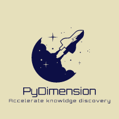

# Dimensionless learning (dimensional analysis + machine learning) for data-drievn knowledge discovery

<p align="center">
  
</p>

## News
We made an online document for PyDimension, which can be found at [here](https://xiaoyuxie.top/PyDimension-Book/intro.html)!

## Identify knowledge in different levels

Our proposed method, namely **dimensionless learning**, is designed to identify and extract scientific insights and patterns from data without being influenced by the scale or size of the input. This enables us to uncover universal scientific knowledge at three different levels:

- **Dimensionless number** at the **feature level** (physical dimension reduction technique): 
  - **Example**: The Reynolds number, denoted as $\mathrm{Re}$, is a well-known dimensionless number that is often used to distinguish between laminar and turbulent flow in fluid dynamics. It is defined as the ratio of inertial forces to viscous forces in a fluid and is given by $\mathrm{Re}=\frac{\rho V l}{\mu}$, where $\rho$ is the density of the fluid, $V$ is the average flow velocity, $l$ is a characteristic length, and $\mu$ is the dynamic viscosity of the fluid. The Reynolds number is interpretable because it represents the ratio of two forces, and it is universal because it is commonly used in fluid dynamics.
- **Scaling law** at the **algebraic equation level**
  - **Example**: The vapor depression dynamics in 3D printing is a complex process with many variables, but our approach allows us to represent it using a simple algebraic equation. Using our methodology, the vapor depression dynamics in 3D printing can be expressed as: $e^*=0.12\mathrm{Ke}-0.30$. This equation shows that the vapor depression dynamics can be described by a combination of two dimensionless numbers, $\mathrm{Ke}$ and $e^*$. The value of $e^*$ can be determined by the value of $\mathrm{Ke}$ using this equation, providing a concise and interpretable representation of the complex vapor depression dynamics in 3D printing.
- **Governing equation** at the **differential equation level**
  - **Example**: The well-known Navier-Stokes equation $\frac{\partial \omega}{\partial t}+u\frac{\partial \omega}{\partial x}+v\frac{\partial \omega}{\partial y}=\mathrm{\frac{1}{Re}}(\frac{\partial^2 \omega}{\partial x^2} +\frac{\partial^2 \omega}{\partial y^2})$ can be identified from data by integrating dimensionless learning with SINDy. Note that in our approach, the coefficient used to describe a physical process or system will be a dimensionless number $\mathrm{Re}$ rather than a scalar that changes depending on the specific case. This means that the coefficient will not have any physical dimensions and will be invariant when the length, time, or energy scale of the system varies.

## Advantages

Our approach is not purely data-driven, but rather combines fundamental physics principles with state-of-the-art machine learning techniques to solve scientific and engineering problems. By embedding the principle of dimensional invariance into a two-level machine learning scheme, our methodology is able to automatically discover dominant dimensionless numbers and governing laws from measurement data. This approach allows us to reduce high-dimensional parameter spaces and simplify complex processes, while still retaining a physically interpretable and accurate representation of the system. The detailed advantages are shown bwlow:

- **Dimension reduction**: 
  - Dimensionless leanring can reduce a large number of parameters to a few dominant dimensionless numbers.
- **Better interpretability**: 
  - The identified dimensionless can be interpreted as the ratio of different forces, velocities, or energies, etc.
  - Lower dimension also allow for qualitative and quantitative analysis of the systems of interest. 
- **Works well in small dataset**: 
  - By incorporating **fundamental physical knowledge** of dimensional invariance, the learning space is limited to a manageable size, which makes it possible to train well-performing models using scarce datasets.
- **Better generalization**:
  - Another benefit for embedding physical invariance is that the learned model have a better generalization in data with different materials and scales.

## Where to find the paper

**Title: Data-driven discovery of dimensionless numbers and governing laws from scarce measurements.** 

This paper was published on ***Nature Communications*** on Dec. 2022. 

You can find the main manuscript [here](https://www.nature.com/articles/s41467-022-35084-w#Sec2).

The Supplymentary Information can be found [here](https://static-content.springer.com/esm/art%3A10.1038%2Fs41467-022-35084-w/MediaObjects/41467_2022_35084_MOESM1_ESM.pdf).

## Documentation
The detailed **online documentation** for PyDimension can be found [here](https://xiaoyuxie.top/PyDimension-Book/intro.html). You can try examples and tutorials interactively without installing any softwares.

## Requirements

### Prepare the requirements

Environments:
```
name: PyDimension
channels:
  - defaults
  - conda-forge
dependencies:
  - pysindy
  - matplotlib
  - pandas
  - tqdm
  - termcolor
  - xgboost
  - salib
  - seaborn
  - ipykernel
  - sympy
  - pyyaml
```

The detailed pip requirements can be found in [requirements.txt](https://github.com/xiaoyuxie-vico/PyDimension/blob/main/requirements.txt).

Create a conda virtual environment called `PyDimension` and install all the requirements:
```
conda create --name PyDimension --file requirements.txt
```

### Run the code online without installing softwares in your personal computers

You can use Binder to run this repository without having to install any Python packages on your personal computer. To do this, you can click on this link: https://mybinder.org/v2/gh/xiaoyuxie-vico/PyDimension/HEAD.

Sometimes, you may encounter errors when deploying the code using Binder. If this happens, simply try running the link again and the issue is likely to be resolved.

Additionally, please note that you will need to download the dataset into the dataset folder after you have successfully opened the repository in Binder. The dataset can be found in this Readme document.

## Getting started

### Scaling law and dimensionless number discovery

1. Scaling law and dimenionless numbers dicsovery
Two typical examples for the scaling law and dimensionless numbers discovery can be found in [scaling_law/keyhole_example_pattern_search.py](https://github.com/xiaoyuxie-vico/PyDimension/blob/main/scaling_law/keyhole_example_pattern_search.py) and [scaling_law/keyhole_example_gradient_descent.ipynb](https://github.com/xiaoyuxie-vico/PyDimension/blob/main/scaling_law/keyhole_example_gradient_descent.ipynb). For the first file, you can run the code directly by using `python keyhole_example_pattern_search.py` after `cd` to this folder. For the second file, you can directly run the jupyter notebook.

2. Generalization comparison with popular machine learning algorithms is shown in [scaling_law/scaling_law/cross_materials.ipynb](https://github.com/xiaoyuxie-vico/PyDimension/blob/main/scaling_law/cross_materials.ipynb) and [scaling_law/cross_scales.ipynb](https://github.com/xiaoyuxie-vico/PyDimension/blob/main/scaling_law/cross_scales.ipynb).

3. A simplified version for pattern search-based two-level optimizaiton can be found at [scaling_law/utils/solver.py](https://github.com/xiaoyuxie-vico/PyDimension/blob/main/scaling_law/utils/solver.py).

4. Sensitive analysis for keyhole example can be found at [scaling_law/sensitive_analysis.ipynb](https://github.com/xiaoyuxie-vico/PyDimension/blob/main/scaling_law/sensitive_analysis.ipynb).

### Differential equation and dimensionless number discovery

1. Discover the governing equations for spring-mass-damper systems: [discover_spring_clean.ipynb](https://xiaoyuxie.top/PyDimension-Book/examples/1_discover_spring_clean.html). I recommend readers to firstly run this code to understand our method in discovering parametrized differential equations.

2. Discover the vorticity form NS equations: [discover_vorticity_equ_3cylinder_clean.ipynb](https://github.com/xiaoyuxie-vico/PyDimension/blob/main/PDE_discovery/discover_vorticity_equ_3cylinder_clean.ipynb).

3. Discover the Euler equation: [discover_Euler_equ_3cylidner_clean.ipynb](https://github.com/xiaoyuxie-vico/PyDimension/blob/main/PDE_discovery/discover_Euler_equ_3cylidner_clean.ipynb).

4. More differential equation discovery examples are shown in [`PDE_discovery`](https://github.com/xiaoyuxie-vico/PyDimension/tree/main/PDE_discovery). 

### Toturials
Read more and detailed tutorials on the [documentation](https://xiaoyuxie.top/PyDimension-Book/intro.html#table-of-contents).

## Dataset

- The dataset for scaling law identification is at [here](https://github.com/xiaoyuxie-vico/PyDimension/tree/main/dataset).
- The dataset for PDE discovery is at [here](https://drive.google.com/drive/folders/1qERCVtyde1RYCkVQp3g4U21Wu6eq5Yui?usp=share_link).

## Citations
```
@article{xie2022data,
  title={Data-driven discovery of dimensionless numbers and governing laws from scarce measurements},
  author={Xie, Xiaoyu and Samaei, Arash and Guo, Jiachen and Liu, Wing Kam and Gan, Zhengtao},
  journal={Nature Communications},
  volume={13},
  number={1},
  pages={1--11},
  year={2022},
  publisher={Nature Publishing Group}
}
@article{gan2021universal,
  title={Universal scaling laws of keyhole stability and porosity in 3D printing of metals},
  author={Gan, Zhengtao and Kafka, Orion L and Parab, Niranjan and Zhao, Cang and Fang, Lichao and Heinonen, Olle and Sun, Tao and Liu, Wing Kam},
  journal={Nature communications},
  volume={12},
  number={1},
  pages={1--8},
  year={2021},
  publisher={Nature Publishing Group}
}
# This paper talks about a Dimensionally invariant Neural Network called DimensionNet
@article{saha2021hierarchical,
  title={Hierarchical Deep Learning Neural Network (HiDeNN): An artificial intelligence (AI) framework for computational science and engineering},
  author={Saha, Sourav and Gan, Zhengtao and Cheng, Lin and Gao, Jiaying and Kafka, Orion L and Xie, Xiaoyu and Li, Hengyang and Tajdari, Mahsa and Kim, H Alicia and Liu, Wing Kam},
  journal={Computer Methods in Applied Mechanics and Engineering},
  volume={373},
  pages={113452},
  year={2021},
  publisher={Elsevier}
}
```

## Related papers and contents
If you are interested in learning about data-driven scientific discovery, I listed some excellent papers and articles that you can use as a starting point. These [resources](https://xiaoyuxie.top/PyDimension-Book/docs/Resources.html#related-papers-and-contents), which can be found in top journals such as *Science* and *Nature*, will give you a strong foundation in data-driven scientific discovery and introduce you to the principles and techniques involved in using data to guide research and uncover new knowledge.

### Dimensional analysis + machine learning
- **Dimensionless learning**: Xie, X., Samaei, A., Guo, J., Liu, W. K., & Gan, Z. (2022). Data-driven discovery of dimensionless numbers and governing laws from scarce measurements. *Nature Communications*, 13(1), 1-11.
- **Dimensional invariant Neural Network (DimensionNet)**: Saha, S., Gan, Z., Cheng, L., Gao, J., Kafka, O. L., Xie, X., … & Liu, W. K. (2021). Hierarchical deep learning neural network (HiDeNN): An artificial intelligence (AI) framework for computational science and engineering. *Computer Methods in Applied Mechanics and Engineering*, 373, 113452.
- **BuckiNet**: Bakarji, J., Callaham, J., Brunton, S. L., & Kutz, J. N. (2022). Dimensionally consistent learning with buckingham pi. arXiv preprint arXiv:2202.04643.
- **Dimensionless machine learning**: Villar, S., Yao, W., Hogg, D. W., Blum-Smith, B., & Dumitrascu, B. (2022). Dimensionless machine learning: Imposing exact units equivariance. arXiv preprint arXiv:2204.00887.
- **Dimensional homogeneity constrained gene expression programming (DHC-GEP)**: Ma, W., & Zhang, J. (2022). Dimensional homogeneity constrained gene expression programming for discovering governing equations from noisy and scarce data. arXiv preprint arXiv:2211.09679.
- **AI Feynman**: Udrescu, S. M., & Tegmark, M. (2020). AI Feynman: A physics-inspired method for symbolic regression. *Science Advances*, 6(16), eaay2631.
- Xu, Z., Zhang, X., Wang, S., & He, G. (2022). Artificial neural network based response surface for data-driven dimensional analysis. *Journal of Computational Physics*, 459, 111145.

## Contact
If you have any questions, suggestions, or would like to contribute to or collaborate on this repository, please contact:
- Xiaoyu Xie
- Northwestern University, Mechanical Engineering
- xiaoyuxie2020@u.northwestern.edu
