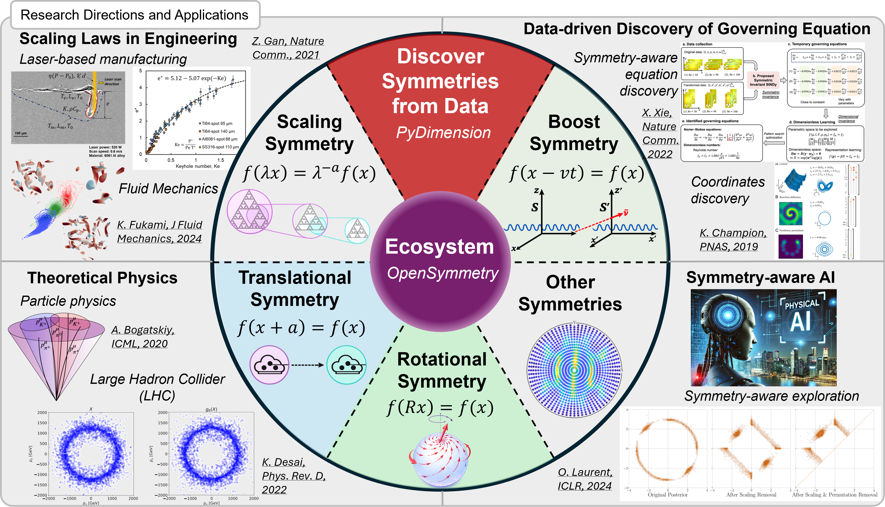

# PyDimension

A modular Python package for **symmetry discovery from data** in physical systems using **data and machine learning**.



## 🚀 Try It Online

**🌐 [Streamlit Web App](https://huggingface.co/spaces/xiaoyuxie-vico/PyDimension)** - Run PyDimension in your browser (no installation required)


> **What is this?** PyDimension is evolving toward **OpenSymmetry**: a modular framework for discovering hidden symmetries from data, including scaling, translational, rotational, and related invariance structures.
> In this framework, **dimensionless learning** is one important module rather than the whole story: it is the scaling-symmetry case, and dimensionless groups are one concrete representation of that symmetry structure.
> The current repository still preserves the production-ready implementation of the dimensionless-learning method from the Nature Communications paper *“Data-driven discovery of dimensionless numbers and governing laws from scarce measurements”*, while expanding toward broader symmetry discovery.


## Relationship to PyDimension v1.0

- **This branch (`main`) – PyDimension**  
  Modern, modular Python package (`pydimension/*`) with command-line tools, Python API and a Streamlit web app for running full pipelines.

- **Legacy research code (`v1.0` branch) – PyDimension v1.0**  
  Original research notebooks and scripts for PDE discovery and case studies used in the paper (kept for reproducibility).

You can browse the legacy materials on GitHub:

- Legacy README and tutorials: `https://github.com/xiaoyuxie-vico/PyDimension/blob/v1.0/README.md`
- Scaling-law examples: `https://github.com/xiaoyuxie-vico/PyDimension/tree/v1.0/scaling_law`
- PDE discovery examples: `https://github.com/xiaoyuxie-vico/PyDimension/tree/v1.0/PDE_discovery`

## PyDimension 3.0 Direction

PyDimension is being redesigned toward **OpenSymmetry**, a broader framework for symmetry-aware scientific discovery.

The current package provides the production-ready implementation of dimensionless learning. The next architecture direction is to keep the codebase concise and consistent while generalizing it beyond the current workflow:

- Keep `data_generation`, but support multiple symmetry-aware generators such as translational, rotational, and scaling cases.
- Merge the current preprocessing and dimensional-analysis responsibilities into a broader `data_preprocessing` stage.
- Rename `constraint_filtering` to `intrinsic_coordinate`, with methods such as PCA, SIR, and autoencoder-decoder models.
- Replace the 3.0 discovery stage with `symmetry_discovery`, using translational, rotational, and scaling encoders to identify which symmetries are hidden in the data.

This redesign follows a first-principles approach: use simple module boundaries, consistent naming, and shared interfaces so that new symmetry classes can be added without duplicating the pipeline.

The current architecture task is documented in `projects/20260308_CODE_STRUCTURE/task.md`.

## Benchmark And Migration Status

The repository now carries two runnable paths during the 3.0 migration:

- `legacy/pydimension_v2/` preserves the PyDimension 2.0 benchmark interface.
- `pydimension/` now contains the first PyDimension 3.0 migration surface for translational symmetry.

The first parity milestone is now wired end-to-end:

- the 2.0 benchmark runs through `legacy/run_pipeline_v2.py`
- the 3.0 translational path runs through `run_pipeline_v3.py`
- `run_pipeline.py` dispatches between them with `--pipeline-version v2|v3`
- the key translational benchmark artifacts match between the two paths, with symmetry-discovery JSON differences limited to timestamps and output-path metadata

## Who is PyDimension for?

- **Experimentalists and engineers** who want to identify which hidden symmetries or invariant structures control their system (e.g., flow, heat transfer, additive manufacturing).
- **Data and ML practitioners** looking for **interpretable, physics-aware models** instead of black-box predictors.
- **Students and researchers** interested in symmetry, dimensional analysis, scaling laws, and data-driven discovery of governing laws.

If you can provide a table of measurements (inputs with units and outputs), PyDimension can help you:

- Detect low-dimensional structure and candidate symmetries hidden in the data.
- Recover interpretable invariants, intrinsic coordinates, and reduced representations.
- In the current dimensionless-learning module, reduce many parameters to a few **dimensionless groups** and learn **simple scaling laws** between those groups and outputs.
- Visualize and interpret how your system behaves across conditions.


## Publications

### Paper 1
**Title:** *A Tutorial on Dimensionless Learning: Geometric Interpretation and the Effect of Noise*  
**Authors:** Zhengtao Gan, Xiaoyu Xie  
**Status:** Preprint  
**Link:** [arXiv:2512.15760](https://www.arxiv.org/abs/2512.15760)

### Paper 2
**Title:** *Data-driven Discovery of Dimensionless Numbers and Governing Laws from Scarce Measurements*  
**Authors:** Xiaoyu Xie, Arash Samaei, Jiachen Guo, Wing Kam Liu, Zhengtao Gan  
**Journal:** *Nature Communications*, Volume 13, Article 7569 (2022)  
**Links:**  
- [Journal Article](https://www.nature.com/articles/s41467-022-35084-w)  
**Note:** This repository (PyDimension) is a refactored, production-ready implementation of the methodology described in the paper. The original research code and notebooks used in the paper are preserved on the [`v1.0` branch](https://github.com/xiaoyuxie-vico/PyDimension/tree/v1.0).

### Video Talks

- **[CMU Scientific Machine Learning Webinar](https://www.youtube.com/watch?v=b3y4ksYzcig)** (March 30, 2023)  
  Presentation on dimensionless learning methodology and applications

- **[Brown University - Math + Machine Learning + X](https://www.youtube.com/watch?v=R6pJleczQr4&t=55s)** (January 27, 2023)  
  Talk on data-driven discovery of dimensionless numbers and governing laws
  
## Quick Start

### Installation

#### Install as a Python Package (Recommended)

```bash
# Clone the repository
git clone https://github.com/xiaoyuxie-vico/PyDimension.git
cd PyDimension

# Install in editable mode (recommended for development)
pip install -e .

# Or install regularly
pip install .
```

After installation, you can use the package from anywhere:
```bash
# Use command-line tools
pydimension-generate --config pydimension/configs/config_translation.json
pydimension-preprocess --config pydimension/configs/config_translation.json
pydimension-intrinsic --config pydimension/configs/config_translation.json
pydimension-symmetry --config pydimension/configs/config_translation.json

# Or use Python API
python -c "from pydimension import DataGenerator; print('✅ Installed successfully')"
```

#### Environment Setup (Alternative)

You can use **Conda**, **Mamba**, or **Micromamba** to create the environment. All three work with the same `environment.yml` file:

**Option 1: Micromamba (Fastest, Recommended)**
```bash
micromamba env create -f environment.yml
micromamba activate pydimension
python test_environment.py
python run_pipeline.py --pipeline-version v3 --config pydimension/configs/config_translation.json
```

**Option 2: Mamba (Faster than Conda)**
```bash
mamba env create -f environment.yml
conda activate pydimension  # Use conda activate even with mamba
python test_environment.py
python run_pipeline.py --pipeline-version v3 --config pydimension/configs/config_translation.json
```

**Option 3: Conda (Standard)**
```bash
conda env create -f environment.yml
conda activate pydimension
python test_environment.py
python run_pipeline.py --pipeline-version v3 --config pydimension/configs/config_translation.json
```

**Option 4: pip (Alternative)**
```bash
python -m venv venv
source venv/bin/activate  # Windows: venv\Scripts\activate
pip install -r requirements.txt
python test_environment.py
python run_pipeline.py --pipeline-version v3 --config pydimension/configs/config_translation.json
```

> **Note**: Conda, Mamba, and Micromamba are all compatible package managers. Choose based on your preference:
> - **Micromamba**: Fastest, standalone (no conda installation needed)
> - **Mamba**: Faster drop-in replacement for conda
> - **Conda**: Standard Anaconda/Miniconda package manager

See [docs/SETUP.md](docs/SETUP.md) for detailed instructions and troubleshooting.

### Web Interface

```bash
streamlit run streamlit_app.py
```

See [docs/STREAMLIT_README.md](docs/STREAMLIT_README.md) for details.

## Overview

PyDimension is moving toward a modular pipeline for **symmetry discovery from data**:

1. **Data Generation** - Generate synthetic datasets with known symmetry structure
2. **Data Preprocessing** - Load, clean, normalize, and reduce raw data into symmetry-ready representations
3. **Intrinsic Coordinate** - Identify low-dimensional latent structure using PCA, SIR, or future autoencoder methods
4. **Symmetry Discovery** - Use symmetry-aware encoders to determine which invariances are present and how they are expressed

Within this broader framework, **dimensionless learning** is the currently mature module. It corresponds to the scaling-symmetry case, where dimensionless groups and scaling laws are the main outputs.

For the migration path toward OpenSymmetry, the current v3 pipeline is:

1. **Data Generation** - symmetry-aware generators, with translational symmetry implemented first
2. **Data Preprocessing** - preprocessing plus dimensional analysis through one unified stage, without a separate 3.0 dimensional-analysis module
3. **Intrinsic Coordinate** - PCA/SIR reuse from 2.0, plus an autoencoder scaffold
4. **Symmetry Discovery** - translational encoder active, rotational/scaling encoder stubs ready

### Key Features

- **Modular Architecture** - Each module is independent and can be used standalone
- **Config-Based** - JSON configuration files for reproducibility
- **Multiple Interfaces** - Command-line, Python API, and web interface
- **Extensible Design** - Easy to add new modules

## Package Structure

```
PyDimension/
├── pydimension/                   # 3.0 OpenSymmetry package
│   ├── data_generation/           # Symmetry-aware data generation
│   │   ├── base.py, translational.py, rotational.py, scaling.py
│   ├── data_preprocessing/        # Unified preprocessing + dimensional analysis
│   │   ├── preprocessor.py, loader.py, normalizer.py
│   │   ├── unit_parser.py, dimension_matrix.py, transforms.py
│   ├── intrinsic_coordinate/      # Latent coordinate discovery
│   │   ├── pca.py, sir.py, autoencoder.py, decoder.py
│   ├── symmetry_discovery/        # Symmetry-aware encoder-based discovery
│   │   ├── engine.py, scoring.py, relation_heads.py
│   │   └── encoders/ (translational, rotational, scaling)
│   ├── benchmarks/                # Reproducible benchmark registry
│   ├── common/                    # Shared I/O, paths, plotting, validation, types
│   └── configs/                   # JSON configs per symmetry type
├── legacy/                        # Preserved 2.0 benchmark
│   ├── pydimension_v2/            # Full 2.0 modules (dimensional_analysis,
│   │                              #   constraint_filtering, optimization_discovery)
│   ├── run_pipeline_v2.py         # Runnable 2.0 benchmark pipeline
│   ├── analyze_dimensions.py      # Legacy convenience scripts
│   ├── filter_constraints.py
│   └── optimize_discovery.py
├── generate_data.py               # 3.0 convenience scripts
├── preprocess_data.py
├── intrinsic_coordinate.py
├── discover_symmetry.py
├── run_pipeline.py                # Dispatch v2 benchmark or v3 pipeline
└── streamlit_app.py               # Web application
```

The full architectural design is documented in `projects/20260308_CODE_STRUCTURE/task.md`.

## Modules

### PyDimension 3.0 (OpenSymmetry pipeline)

| Stage | Module | Methods | Quick Start |
|-------|--------|---------|-------------|
| 1 | **Data Generation** | translational, rotational\*, scaling\* | `python generate_data.py --config pydimension/configs/config_translation.json` |
| 2 | **Data Preprocessing** | dimensional analysis (merged) | `python preprocess_data.py --config pydimension/configs/config_translation.json` |
| 3 | **Intrinsic Coordinate** | PCA, SIR, autoencoder\* | `python intrinsic_coordinate.py --config pydimension/configs/config_translation.json` |
| 4 | **Symmetry Discovery** | translational encoder, rotational\*, scaling\* | `python discover_symmetry.py --config pydimension/configs/config_translation.json` |

\* scaffold - interface defined, implementation reserved for a later phase.

### Legacy 2.0 (benchmark reference, in `legacy/`)

| Module | Quick Start |
|--------|-------------|
| Dimensional Analysis | `python legacy/analyze_dimensions.py --config pydimension/configs/config_synthetic.json` |
| Constraint Filtering | `python legacy/filter_constraints.py --config pydimension/configs/config_synthetic.json` |
| Optimization Discovery | `python legacy/optimize_discovery.py --config pydimension/configs/config_synthetic.json --plot` |

## Workflow

### v3 OpenSymmetry Pipeline (Recommended)

```bash
# Full 3.0 translational pipeline (data gen → preprocessing+DA → intrinsic coord → symmetry discovery)
python run_pipeline.py --pipeline-version v3 --config pydimension/configs/config_translation.json

# Or step by step
python generate_data.py     --config pydimension/configs/config_translation.json --plot
python preprocess_data.py   --config pydimension/configs/config_translation.json --plot
python intrinsic_coordinate.py --config pydimension/configs/config_translation.json
python discover_symmetry.py --config pydimension/configs/config_translation.json
```

### v2 Benchmark Pipeline

```bash
# Full 2.0 benchmark (preserved for parity validation)
python run_pipeline.py --pipeline-version v2 --config legacy/pydimension_v2/configs/config_synthetic_v2.json

# Or step by step (legacy scripts now in legacy/)
python generate_data.py                --config pydimension/configs/config_synthetic.json --plot
python preprocess_data.py              --config pydimension/configs/config_synthetic.json --plot
python legacy/analyze_dimensions.py    --config pydimension/configs/config_synthetic.json --plot
python legacy/filter_constraints.py    --config pydimension/configs/config_synthetic.json --plot
python legacy/optimize_discovery.py    --config pydimension/configs/config_synthetic.json --plot
```

## Configuration

All modules use a unified JSON configuration file. The 3.0 config schema uses section names that match the new module names:

```json
{
  "DATA_GENERATION": { },
  "DATA_PREPROCESSING": { "preprocessing_method": "dimensional_analysis" },
  "INTRINSIC_COORDINATE": { "method": "pca_sir" },
  "SYMMETRY_DISCOVERY": { "symmetry_type": "translational", "encoder_name": "translational" },
  "OUTPUT": { "output_dir": "output_v3_translation" }
}
```

Available config files:

| File | Symmetry | Pipeline |
|------|----------|----------|
| `config_translation.json` | translational | 3.0 |
| `config_rotation.json` | rotational (scaffold) | 3.0 |
| `config_scaling.json` | scaling (scaffold) | 3.0 |
| `config_synthetic.json` | translational | 2.0 |
| `config_keyhole.json` | translational (real) | 2.0 |

See [pydimension/configs/README.md](pydimension/configs/README.md) for details.

## Interfaces

### Web Interface (Streamlit)

```bash
streamlit run streamlit_app.py
```

Features: Interactive configuration, real-time execution, inline visualization, results viewer.

### Command-Line Interface

```bash
# Run any module directly
python -m pydimension.data_generation --config pydimension/configs/config_translation.json --plot

# Or use convenience scripts
python generate_data.py --config pydimension/configs/config_translation.json --plot
python discover_symmetry.py --config pydimension/configs/config_translation.json
```

### Python API

```python
from pydimension.data_generation import DataGenerator, DataGenerationConfig
from pydimension.symmetry_discovery import SymmetryDiscoveryEngine, SymmetryDiscoveryConfig

# Generate data
gen_config = DataGenerationConfig.from_json('pydimension/configs/config_translation.json')
generator = DataGenerator(gen_config)
generator.generate()
generator.save_datasets()

# Discover symmetry
sd_config = SymmetryDiscoveryConfig.from_json('pydimension/configs/config_translation.json')
engine = SymmetryDiscoveryEngine(sd_config)
artifacts = engine.process(verbose=True)
```

## Documentation

- **[docs/SETUP.md](docs/SETUP.md)** - Installation and setup guide
- **[docs/USAGE.md](docs/USAGE.md)** - How to use the package (CLI, API, scripts)
- **[docs/TESTING.md](docs/TESTING.md)** - Testing guide and verification
- **[docs/DEVELOPMENT.md](docs/DEVELOPMENT.md)** - Development workflow and code checking
- **[docs/WORKFLOW.md](docs/WORKFLOW.md)** - Quick push workflow and deployment shortcuts
- **[docs/STREAMLIT_README.md](docs/STREAMLIT_README.md)** - Web interface guide
- **[docs/HUGGINGFACE_DEPLOY.md](docs/HUGGINGFACE_DEPLOY.md)** - Hugging Face Spaces deployment guide
- **Module READMEs**: Detailed docs in `pydimension/*/README.md`
- **Config Files**: [pydimension/configs/README.md](pydimension/configs/README.md)

## Output Structure

```
output/
├── data/              # Generated datasets (CSV)
├── figures/           # Visualizations (PNG)
└── results/          # Analysis results (JSON)
```

## Requirements

- Python 3.7+
- NumPy >= 1.21.0, Pandas >= 1.3.0, SciPy >= 1.7.0
- SymPy >= 1.9.0 (for symbolic simplification)
- Matplotlib >= 3.4.0, Seaborn >= 0.12.0 (for visualization)
- scikit-learn >= 1.0.0 (for scaling and metrics)
- PyTorch >= 1.9.0 (for neural network training)

## Contributing

When adding a new symmetry type or module:
1. Follow the established module structure (see `projects/20260308_CODE_STRUCTURE/task.md`)
2. Add a benchmark descriptor in `pydimension/benchmarks/`
3. Create a JSON config file in `pydimension/configs/`
4. Implement the shared base interfaces (`BaseSymmetryEncoder`, `BaseIntrinsicCoordinateMethod`, etc.)
5. Update `pydimension/__init__.py` and module READMEs

## License

This project is licensed under the **MIT License**. See the [LICENSE](LICENSE) file for details.

## Citations

```

@article{xie2022data,
  title={Data-driven discovery of dimensionless numbers and governing laws from scarce measurements},
  author={Xie, Xiaoyu and Samaei, Arash and Guo, Jiachen and Liu, Wing Kam and Gan, Zhengtao},
  journal={Nature Communications},
  volume={13},
  number={1},
  pages={1--11},
  year={2022},
  publisher={Nature Publishing Group}
}
```

## Contact

If you have any questions, suggestions, or would like to contribute to or collaborate on this repository, please contact:

- Xiaoyu Xie
  - Email: xiaoyuxie.vico@gmail.com
- Zhengtao Gan
  - Email: Zhengtao.Gan@asu.edu

